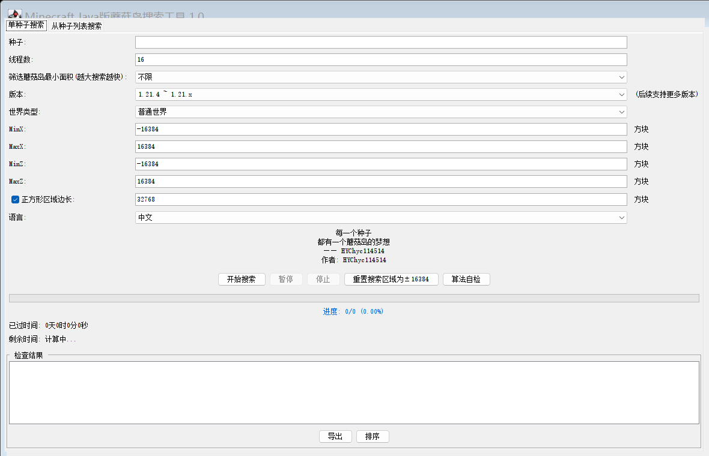

# Minecraft Java版 蘑菇岛搜索工具 1.0

输入世界种子，搜索范围内的**蘑菇岛（mushroom_fields）**，按面积从大到小列出超大蘑菇岛的位置、范围与面积。

作者：**HYChyc114514**
核心算法移植自开源库 [cubiomes](https://github.com/Cubitect/cubiomes)（MIT），与 Chunkbase 一致，已通过 cubiomes 官方测试基准（1.18 / 1.19.2 / 1.19.4 / 1.20.6 四套黄金哈希）与 Chunkbase 1.21.4 / 26.3 网页版双重交叉验证。

## 界面截图



## 下载

到 [Releases](https://github.com/hyc1965535896/mushroom-island-finder/releases) 下载 `MushroomIslandFinder-1.2.jar`，双击即可运行（需已安装 Java 17+）；或下载源码后运行 `启动蘑菇岛搜索工具.bat`。

## 快速开始

双击 `启动蘑菇岛搜索工具.bat`，或命令行运行：

```
java FindMushroomIslands.java
```

只需要 JDK 17+（HMCL 等启动器自带的 JDK 即可），无需安装任何依赖；首次运行会有约 1~2 秒的内存编译时间。

## 图形界面

- **单种子搜索**：输入种子（支持数字或文字种子，文字种子按 Minecraft 规则自动转数字）→ 开始搜索。
- **从种子列表搜索**：选择一个 txt 文件（每行一个种子，`#` 开头为注释），批量筛选出区域内有满足面积要求的蘑菇岛的种子。
- **筛选蘑菇岛最小面积**：设得越大，泛洪填充阶段保留的岛越少，结果导出越干净，搜索也越快。
- **版本**：1.18 ~ 1.21.x（五套判定表）。**26.3 已实测**：同一批种子对比 Chunkbase 的 26.3 与 1.21.4 地图完全一致，说明蘑菇岛生成未变，可直接使用；后续新版本如有变化请重新抽查。
- **世界类型**：普通世界 / 大型生物群系（两者的噪声盐值不同）。
- **搜索区域**：MinX/MaxX/MinZ/MaxZ（方块坐标）；勾选"正方形区域边长"后改一个数字即可同步四界。默认 ±16384。
- **算法自检**：一键运行 cubiomes 官方基准测试，全部 OK 说明移植无误。
- **暂停 / 停止**：随时暂停（继续）或终止搜索。
- **导出**：把结果保存为 txt；**排序**：在"按面积"和"距原点"之间切换。

结果行格式：

```
#1   中心 (-146, 11838)  范围 1184 x 640  面积 ≈ 342,592 方块²  距原点 11,838
```

- 中心：岛的质心方块坐标（可用 `/tp` 直接前往）。
- 范围：包围盒宽 × 高（方块）。面积是按覆盖率估算的近似值。

## 命令行模式（可选）

```
java FindMushroomIslands.java <种子> [-r 半径] [-top N] [-mc 版本] [-large] [-min 格子数]
java FindMushroomIslands.java --test     # 运行 cubiomes 黄金自检
```

示例：`java FindMushroomIslands.java 12345 -r 16384 -top 5`

## 游戏内验证

到坐标附近后执行：

```
/locate biome minecraft:mushroom_fields
```

会给出最近的蘑菇岛坐标；或直接 `/tp <x> <y> <z>` 到岛的质心查看。

## 工作原理（简述）

1. 复现 1.18+ 的**多重噪声生物群系生成**：Xoroshiro128++ 随机流、Improved Noise/双重 Perlin 噪声，按 vanilla 盐值（md5("minecraft:temperature") 等）初始化温度/湿度/大陆性/侵蚀/奇异性/偏移 6 个噪声通道。
2. 用 vanilla 的**地形偏移样条**计算深度参数，得到六维气候点。
3. 在 cubiomes 生成的**气候→群系 KD 判定树**（5 套版本表，自动转换）中做最近邻查找，得到与游戏一致的群系 ID。
4. 网格扫描（自动选步长，多线程）→ 标记 mushroom_fields → 泛洪填充连通块 → 对大岛用更细步长 + 高度带（方块 48~90）重扫得到精确范围。

## 已知限制

- 面积/范围是估算值（粗扫 64~ 步长 + 细化 8+ 步长），与逐方块精确值可能差几格。
- 支持 1.18 ~ 1.21.x；pre-1.18 的旧版本与未来新版本尚未支持（26.3 已实测一致）。
- 搜索深度带固定在地表附近（方块 48~90），极端地形下可能漏掉完全被埋的蘑菇群系区域。

## 开源协议

本项目以 [MIT](LICENSE) 协议开源，版权所有 HYChyc114514；其中移植自 cubiomes 的部分遵循其 MIT 协议（见 LICENSE 内的第三方声明）。

## 目录说明

- `FindMushroomIslands.java` — 全部代码（单文件，含算法、扫描引擎、Swing 界面）
- `启动蘑菇岛搜索工具.bat` — 双击启动
- `tools/convert_btree.py` — 从 cubiomes 表格生成 Java 判定表的脚本（升级 cubiomes 时重跑）
- `tools/ref_check.py` — Python 独立参考实现（float32 模拟），可交叉验证
- `_ref/cubiomes-master/` — cubiomes 参考源码
